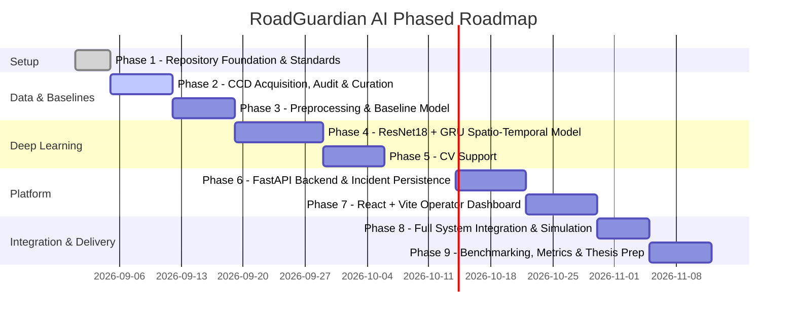

# RoadGuardian AI - Phased Development Plan

**Project:** Video-Based Road Accident Detection and Intelligent Emergency Incident Management  
**Role:** Senior AI/ML Architect & Engineering Lead  
**Target:** Final-Year B.Tech Academic Evaluation, Portfolio & Placement Demonstrations  

---

## 1. Development Principles & Strategy

To guarantee that RoadGuardian AI meets high academic and industry engineering standards, development proceeds under five core architectural principles:

1. **Verification Before Training:** No neural network is trained before the dataset is thoroughly audited for class balance, annotation consistency, resolution variance, and train/val/test data leakage.
2. **Benchmark-Driven Progression:** A simple, deterministic baseline model must be implemented and evaluated *before* complex spatio-temporal deep learning models are introduced.
3. **Decoupled Auxiliary Modules:** Object detection (YOLO) and multi-object tracking (ByteTrack) serve as independent contextual layers and are decoupled from the core accident classifier.
4. **Honest & Grounded Claims:** The system is explicitly presented as an offline video analysis prototype. No claims of "real-time citywide surveillance" or "medical trauma diagnosis" are made.
5. **Ethical Simulation:** All emergency dispatch actions and alerts remain strictly simulated, safe, and academically grounded.

---

## 2. Phased Roadmap Overview

---

## 3. Detailed Phase Breakdown

### Phase 1: Foundation, Architecture & Repository Setup (Status: COMPLETE)
- **Objective:** Establish a clean, modular repository layout, configuration templates, documentation, and dependency specifications.
- **Key Tasks:**
  - Create standardized directory hierarchy (`dataset/`, `notebooks/`, `ml/`, `computer_vision/`, `backend/`, `frontend/`, `docs/`, `tests/`, `scripts/`).
  - Configure `.gitignore` with strict rules against checking in datasets, checkpoints, environments, and secrets.
  - Formulate dependency manifests (`requirements.txt`).
  - Author core architectural blueprints (`README.md`, `project_scope.md`, `system_architecture.md`, `development_plan.md`).
- **Validation Criteria:** Clean directory tree verified; `.gitignore` validated; zero untracked binary dependencies.

---

### Phase 2: Dataset Acquisition, Audit & Verification (Status: COMPLETED)
- **Objective:** Acquire, verify, audit, and partition the selected Car Crash Dataset (CCD - ACM MM '20).
- **Key Deliverables & Verified Metrics:**
  - Acquired full 4,500 clip dataset (1,500 accident, 3,000 normal).
  - 100% decodability audit via `scripts/verify_dataset.py` (4,500/4,500 valid clips, 0 corrupted).
  - Authoritative manifest created: `dataset/metadata/dataset_manifest.csv`.
  - Video-level stratified partition executed via `scripts/create_video_splits.py` (70/15/15 ratio, seed=42):
    - `TRAIN`: 3,150 clips (1,050 accident, 2,100 normal)
    - `VALIDATION`: 675 clips (225 accident, 450 normal)
    - `TEST`: 675 clips (225 accident, 450 normal)
  - Zero cross-partition video ID or frame leakage verified ($\text{Train} \cap \text{Val} = \emptyset$, $\text{Train} \cap \text{Test} = \emptyset$, $\text{Val} \cap \text{Test} = \emptyset$).

---

### Phase 3: Video Preprocessing & Baseline Model Development (Status: PREPROCESSING COMPLETE - BASELINE PENDING)
- **Objective:** Implement video sequence ingestion and preprocessing suitable for torchvision ResNet-18 feature extraction, and establish the baseline performance benchmark.
- **Preprocessing Implementation (`ml/preprocessing/`):**
  - `ml/preprocessing/transforms.py`: `VideoTransform` converts RGB frames to $224 \times 224$ tensors with ImageNet normalization ($\mu = [0.485, 0.456, 0.406]$, $\sigma = [0.229, 0.224, 0.225]$).
  - `ml/preprocessing/video_dataset.py`: `VideoDataset` reads authoritative `dataset_manifest.csv`, enforces strict video-level partition, performs on-the-fly OpenCV decoding (BGR $\rightarrow$ RGB) to eliminate loose disk frame overhead, and deterministically samples $T=16$ frames spanning each 50-frame clip. Returns `(frames: FloatTensor [16, 3, 224, 224], label: LongTensor, video_id: str)`.
  - `scripts/test_preprocessing.py`: Smoke-tested all partitions (`TRAIN`, `VALIDATION`, `TEST`) confirming shape `[16, 3, 224, 224]`, finite values, and zero errors.
- **Pending Tasks:**
  - Develop lightweight baseline classifier in `ml/baseline/`.
  - Evaluate baseline on test set using Precision, Recall, F1-Score, and ROC-AUC.
- **Validation Criteria:** Baseline model completes end-to-end training and evaluation; establishes minimum benchmark floor.

---

### Phase 4: ResNet18 + GRU Spatio-Temporal Model
- **Objective:** Implement and train the primary deep learning architecture combining spatial representations with sequential temporal modeling.
- **Key Tasks:**
  - Construct `ml/resnet_gru/spatial_extractor.py`: Pretrained ResNet-18 feature extraction module (removing final classification layer to produce 512-dimensional feature vectors per frame).
  - Construct `ml/resnet_gru/temporal_gru.py`: Multi-layer GRU accepting sequence tensors of shape `(Batch, Time, 512)` to capture temporal collision dynamics.
  - Implement training pipeline with binary cross-entropy / focal loss, AdamW optimizer, and learning rate scheduling in `ml/resnet_gru/train.py`.
  - Implement validation checkpointing based on Validation F1-score and ROC-AUC.
  - Implement inference smoothing filter in `ml/inference/detector.py` to prevent transient false alarms.
- **Validation Criteria:** ResNet18 + GRU demonstrates measurable performance gain over the Phase 3 baseline on precision, recall, and false-alarm rate.

---

### Phase 5: Computer Vision Auxiliary Modules (YOLO + ByteTrack)
- **Objective:** Provide supplementary spatial localization of vehicles and motion trajectory tracking to support severity estimation.
- **Key Tasks:**
  - Implement `computer_vision/detection/vehicle_detector.py` utilizing YOLOv8 configured for vehicular classes (car, truck, bus, motorcycle).
  - Implement `computer_vision/tracking/tracker.py` integrating ByteTrack for persistent vehicle identity assignment across consecutive frames.
  - Compute spatial interaction heuristics: bounding box overlaps, sudden velocity drops, and trajectory anomalies.
  - Package module as an auxiliary service that operates on detected accident windows.
- **Validation Criteria:** Multi-vehicle tracking operates smoothly on sample traffic sequences; correctly flags abnormal deceleration or proximity.

---

### Phase 6: FastAPI Backend & SQLite Incident Management
- **Objective:** Build an asynchronous backend for video ingestion, inference orchestration, incident persistence, and simulated dispatch.
- **Key Tasks:**
  - Initialize FastAPI application structure (`backend/app/main.py`).
  - Configure SQLAlchemy database models in `backend/app/models/incident.py` for Incidents, Videos, and SimulatedDispatches.
  - Define Pydantic request/response schemas in `backend/app/schemas/`.
  - Implement video upload and background inference task execution in `backend/app/services/video_service.py`.
  - Implement evidence snapshot extraction saving key collision frames to `backend/snapshots/`.
  - Implement simulated emergency dispatch engine in `backend/app/services/simulation_service.py`.
- **Validation Criteria:** Uploaded video triggers background analysis, writes incident record to SQLite, saves evidence snapshot, and creates mock dispatch payload.

---

### Phase 7: React + Vite Operator Dashboard
- **Objective:** Build a responsive, modern web dashboard for traffic operators and project examiners.
- **Key Tasks:**
  - Initialize React + Vite project in `frontend/`.
  - Build Operator Navigation & Dashboard Layout.
  - Implement Video Upload Module with real-time processing status.
  - Build Synchronized Video Player displaying detection probabilities across the video timeline.
  - Build Incident Management Table with filtering by severity (Low, Medium, High), timestamp, and review status.
  - Build Simulated Emergency Dispatch Center displaying mock units, ETAs, and dispatch status badges.
- **Validation Criteria:** User can upload a video, observe analysis progress, inspect detected incidents on the timeline, and view simulated dispatch payloads.

---

### Phase 8: End-to-End System Integration & Testing
- **Objective:** Connect all architectural tiers into an integrated application and perform end-to-end verification.
- **Key Tasks:**
  - Author integration tests in `tests/test_api.py` and `tests/test_inference_pipeline.py`.
  - Verify complete workflow: Video Upload $\rightarrow$ OpenCV Preprocessing $\rightarrow$ ResNet18+GRU Inference $\rightarrow$ SQLite Record $\rightarrow$ Evidence Snapshot $\rightarrow$ Simulated Dispatch $\rightarrow$ React UI Display.
  - Handle edge cases: Corrupted video files, normal videos with zero accidents, low-light videos.
- **Validation Criteria:** Zero unhandled runtime exceptions; smooth operator experience from upload to simulated dispatch.

---

### Phase 9: Evaluation, Benchmarking & Academic Documentation
- **Objective:** Finalize empirical evaluation, document research methodologies, and prepare presentation artifacts for academic defense.
- **Key Tasks:**
  - Generate comprehensive evaluation plots: Confusion Matrix, ROC-AUC Curve, Precision-Recall Curve, and Inference Latency (FPS) benchmarks.
  - Compare Baseline Model vs. ResNet18 + GRU with empirical tables.
  - Finalize academic project report and slide deck outlining methodology, system architecture, results, and limitations.
- **Validation Criteria:** Complete, reproducible evaluation pipeline with all benchmark metrics and visual artifacts documented.
