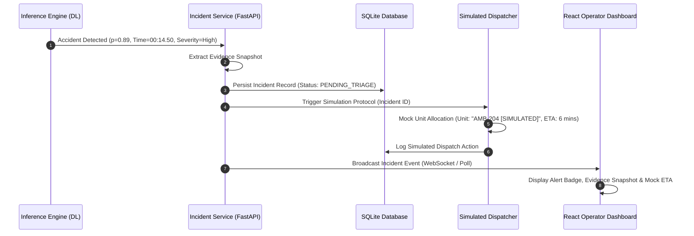

# Project Scope & System Boundaries

**Project Name:** RoadGuardian AI: Video-Based Road Accident Detection and Intelligent Emergency Incident Management  
**Project Classification:** Final-Year B.Tech Computer Science & Engineering Capstone Project  
**Implementation Paradigm:** Software-Only Deep Learning & Computer Vision Prototype  

---

## 1. Executive Summary

RoadGuardian AI is an academic and portfolio-oriented software application designed to detect road traffic accidents from recorded video footage using deep learning architectures and spatio-temporal modeling. Upon detecting a collision, the system generates an incident record containing crucial diagnostic metadata, extracts an evidence snapshot, assigns a heuristic severity classification, and triggers a **simulated** emergency incident dispatch sequence.

To ensure academic rigor, reproducibility, and ethical compliance, the project establishes precise functional boundaries, explicitly separating production-ready computer vision and deep learning techniques from simulated external integrations.

---

## 2. In-Scope Features (Included)

The following capabilities are formally defined as part of the core software implementation:

### 2.1 Video Ingestion & Processing
- **Format Support:** Processing of standard video formats (`.mp4`, `.avi`, `.mov`, `.mkv`) uploaded by the operator.
- **Frame Extraction & Temporal Windowing:** Deterministic frame sampling and sliding sequence construction using OpenCV to produce consistent spatio-temporal tensor inputs.

### 2.2 Core Deep Learning Pipeline
- **Baseline Classifier:** Lightweight initial classifier (e.g., frame-level 2D CNN or feature-pooled classifier) established first to serve as a performance benchmark.
- **Spatio-Temporal Sequence Modeling:**
  - **Spatial Feature Extractor:** Pretrained ResNet-18 extracting rich visual representations from individual video frames.
  - **Temporal Sequence Analyzer:** Gated Recurrent Unit (GRU) network modeling sequential transition dynamics, abrupt motion changes, and post-collision states across consecutive frames.
- **Classification Output:** Binary classification generating continuous accident probabilities:
  $$\hat{y} \in [0.0, 1.0] \quad (\text{Normal} \text{ vs. } \text{Accident})$$
- **Temporal Post-Processing:** Moving-average smoothing and threshold gating across window predictions to prevent single-frame flickering or transient false positives.

### 2.3 Supporting Computer Vision Modules
- **Vehicle Localization (YOLO):** Object detection to identify vehicles (cars, motorcycles, trucks, buses) within the frame.
- **Multi-Object Tracking (ByteTrack):** Association of bounding boxes across successive frames to capture vehicle trajectories and velocity shifts.
- *Note:* These modules operate as distinct, modular support layers rather than end-to-end monolithic dependencies, keeping DL model training decoupled from detector weights.

### 2.4 Incident Record Generation & Evidence Capture
- **Accident Probability Score:** Calibrated confidence metric reflecting detection certainty.
- **Timestamp & Frame Indexing:** Precise second-by-second localization of the point of collision within the video.
- **Automated Evidence Snapshot:** Extraction and storage of key visual frames corresponding to peak collision likelihood.
- **Heuristic Severity Classification:** Prototype-level impact categorization (Low, Medium, High) derived strictly from visual collision dynamics, bounding box overlap, and confidence thresholds.

### 2.5 Backend Architecture & Persistence
- **RESTful API Services:** High-performance asynchronous backend developed using Python and FastAPI.
- **Relational Data Persistence:** Structured SQLite database storing records of processed videos, detected incidents, timestamps, heuristic severity, and simulated dispatch audit trails.

### 2.6 Frontend Operator Dashboard
- **Web Interface:** Responsive Single Page Application (SPA) built using React + Vite.
- **Key Views:**
  - Video upload portal with progress indicators.
  - Interactive video playback synchronized with accident probability timelines.
  - Incident management table with evidence snapshot previews and filtering.
  - Simulated emergency dispatch control panel displaying active mock response units.

---

## 3. Out-of-Scope Features (Excluded)

To maintain realistic engineering boundaries, the following components are explicitly excluded from this software implementation:

| Excluded Feature | Engineering Justification |
| :--- | :--- |
| **Real-Time City CCTV Streaming (RTSP)** | Academic projects operating without dedicated GPU server infrastructure cannot guarantee sub-second real-time streaming constraints without frame skipping. The system is designed for uploaded video clips. |
| **Real Emergency Service Dispatch** | Integration with live 911, 112, or 108 emergency telephony, SMS dispatchers, or municipal police/hospital APIs is prohibited due to safety, legal, and false-alarm liabilities. |
| **Medical / Casualty Severity Diagnosis** | The system does not diagnose human bodily injury, physiological trauma, or fatality risk. Severity is strictly an image-based visual impact heuristic. |
| **Hardware & IoT Telematics Integration** | No vehicle CAN-bus, OBD-II readers, physical accelerometers, or roadside edge IoT microcontrollers are included; the solution is strictly software-based vision. |
| **Automatic License Plate Recognition (ALPR)** | Excluded to preserve system focus on deep learning spatio-temporal accident detection rather than optical character recognition and identity surveillance. |
| **Paid / Proprietary Cloud APIs** | No dependency on paid computer vision APIs (e.g., Google Cloud Vision, AWS Rekognition) to maintain 100% open-source reproducibility. |

---

## 4. Software-Only Scope Justification

RoadGuardian AI is architected strictly as a **software-only system** for the following reasons:

1. **Academic Evaluation Integrity:** Examiners can clone the repository, set up a standard Python virtual environment, install dependencies from `requirements.txt`, and execute the pipeline on any standard workstation or laptop without requiring proprietary hardware.
2. **Focus on Deep Learning Core:** The project concentrates on the engineering challenges of video sequence processing, spatial feature extraction, temporal dynamics modeling, and metric evaluation rather than embedded hardware assembly.
3. **Reproducible Benchmarks:** Offline evaluation on standardized benchmark datasets ensures that accuracy, precision, recall, and F1-score can be empirically validated against academic baselines.
4. **Clean Decoupling:** Modularity allows any component (e.g., swapping ResNet18 for an alternate backbone, or SQLite for PostgreSQL) to be upgraded independently.

---

## 5. Simulated Emergency Response Mechanism

### 5.1 Rationale for Simulation
In real-world intelligent transportation systems, automated detection feeds into a Computer-Aided Dispatch (CAD) system. However, in an academic environment, triggering actual emergency responders is both unlawful and unethical. RoadGuardian AI simulates this operational workflow to demonstrate practical utility while adhering to strict safety protocols.

### 5.2 Simulation Architecture & Workflow
When the inference engine detects an accident with probability surpassing the configured decision threshold ($\tau \ge 0.75$):



### 5.3 Simulated Dispatch Payload Schema
The system constructs realistic dispatch notifications formatted according to modern CAD payloads, clearly tagged with a simulation flag:

```json
{
  "simulation_mode": true,
  "incident_id": "INC-2026-0084",
  "detected_at": "2026-09-14T15:42:10Z",
  "video_timestamp": "00:00:14.500",
  "accident_probability": 0.892,
  "heuristic_severity": "HIGH",
  "evidence_snapshot_url": "/snapshots/INC-2026-0084_evidence.jpg",
  "simulated_dispatch": {
    "assigned_unit": "Ambulance Unit 104 [SIMULATED]",
    "station_id": "Zone-3 Central Trauma Response [MOCK]",
    "estimated_arrival_minutes": 7,
    "current_status": "DISPATCHED_SIMULATED",
    "disclaimer": "FOR ACADEMIC / SIMULATION PURPOSES ONLY. NO LIVE SERVICES CONTACTED."
  }
}
```

### 5.4 Prototype Severity Estimation Logic
Severity is computed via a transparent rule-based heuristic function that evaluates visual dynamics:
- **Low Severity:** Brief collision probability peak without sustained high-confidence windows; minor trajectory perturbation.
- **Medium Severity:** Sustained collision probability exceeding threshold; multiple vehicles detected in proximity.
- **High Severity:** Rapid velocity deceleration across tracked vehicles combined with prolonged high-confidence accident prediction ($\ge 0.85$) and bounding box convergence.

*Disclaimer:* This severity indicator assists operator prioritization in the simulated dashboard and does not represent an actual physical trauma assessment.
