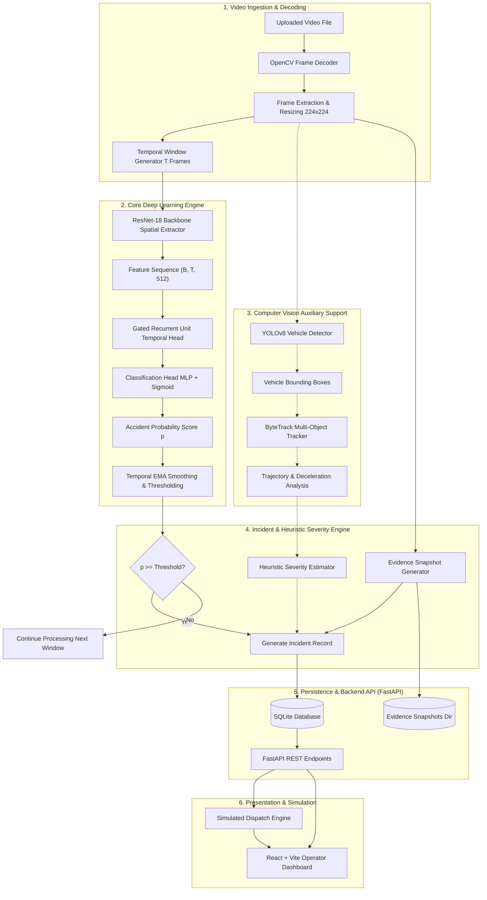
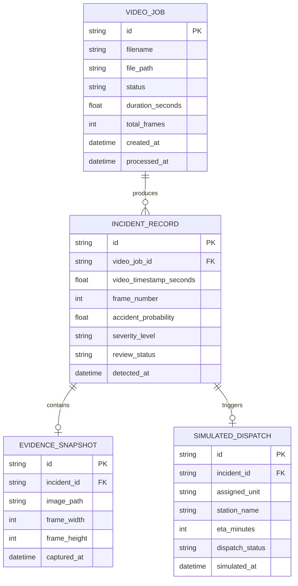
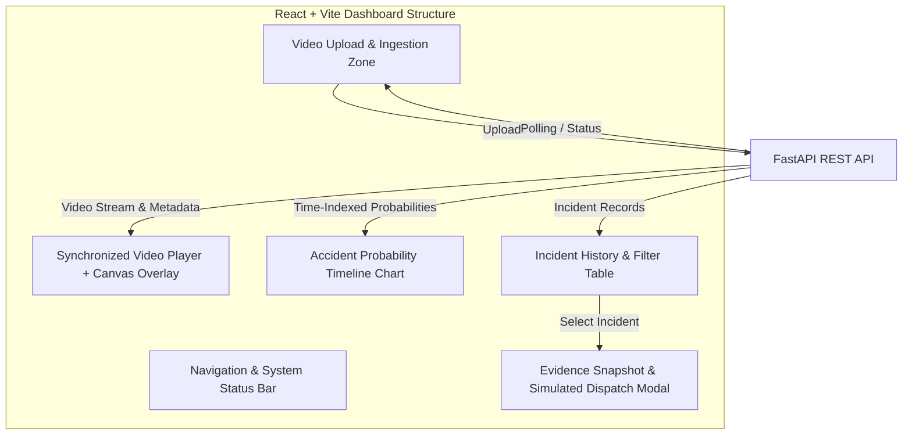

# RoadGuardian AI - System Architecture Document

**Document Version:** 1.0.0  
**Project:** RoadGuardian AI: Video-Based Road Accident Detection and Intelligent Emergency Incident Management  
**Classification:** Technical Architecture & System Design Specification  

---

## 1. System Architectural Overview

RoadGuardian AI is architected as a modular, decoupled software platform that ingests recorded traffic videos, performs spatial-temporal feature modeling for accident detection, tracks involved vehicles as an auxiliary context layer, extracts evidence artifacts, and orchestrates a simulated emergency incident response workflow.

### 1.1 End-to-End System Block Diagram



---

## 2. Core Deep Learning Pipeline (ResNet18 + GRU)

### 2.1 Spatial Feature Extraction (ResNet-18 Backbone)
- **Input:** A sequence of $T$ consecutive RGB frames, each resized to $224 \times 224 \times 3$ and normalized using ImageNet mean ($[0.485, 0.456, 0.406]$) and standard deviation ($[0.229, 0.224, 0.225]$).
- **Architecture:** Pretrained ResNet-18 network stripped of its final fully connected classification layer (`fc`).
- **Feature Vector:** The output of the global average pooling layer yields a dense spatial representation vector:
  $$\mathbf{f}_t = \text{ResNet18}(\mathbf{x}_t) \in \mathbb{R}^{512}$$
- **Sequence Representation:** For a window of length $T$, the concatenated spatial feature matrix is:
  $$\mathbf{F} = [\mathbf{f}_1, \mathbf{f}_2, \dots, \mathbf{f}_T]^\top \in \mathbb{R}^{T \times 512}$$

### 2.2 Temporal Sequence Modeling (Gated Recurrent Unit - GRU)
Road accidents are inherently sequential events defined by rapid transitions: stable vehicle motion $\rightarrow$ abrupt trajectory divergence / high deformation $\rightarrow$ post-impact halt. Standard static frame classifiers miss this temporal causality.

- **GRU Equations:** At each time step $t \in \{1, \dots, T\}$:
  $$r_t = \sigma(W_r \mathbf{f}_t + U_r h_{t-1} + b_r) \quad \text{(Reset Gate)}$$
  $$z_t = \sigma(W_z \mathbf{f}_t + U_z h_{t-1} + b_z) \quad \text{(Update Gate)}$$
  $$\tilde{h}_t = \tanh(W_h \mathbf{f}_t + U_h (r_t \odot h_{t-1}) + b_h) \quad \text{(Candidate State)}$$
  $$h_t = (1 - z_t) \odot h_{t-1} + z_t \odot \tilde{h}_t \quad \text{(Hidden State)}$$
- **Hyperparameters:**
  - Hidden State Dimension: $H = 128$
  - Number of Recurrent Layers: $L = 2$
  - Dropout: $0.3$ between layers

### 2.3 Binary Classification & Temporal Post-Processing
- **Classification Head:** The final hidden state $h_T$ (or temporal attention-pooled state) is passed to a classification MLP:
  $$\hat{y} = \sigma(W_2 \cdot \text{ReLU}(W_1 h_T + b_1) + b_2) \in [0.0, 1.0]$$
- **Temporal Smoothing:** To prevent sporadic false positives from single erratic frames, a sliding exponential moving average (EMA) is applied:
  $$\bar{p}_t = \alpha \hat{y}_t + (1 - \alpha) \bar{p}_{t-1}, \quad \alpha \in [0.4, 0.6]$$
- **Decision Gating:** An incident is triggered if $\bar{p}_t \ge \tau$ for $k$ consecutive windows (default $\tau = 0.75$, $k = 2$).

---

## 3. Computer Vision Auxiliary Module (YOLO + ByteTrack)

The auxiliary computer vision module provides contextual scene intelligence without coupling detector weights into the deep learning accident classifier.


### 3.1 Vehicle Detection (YOLOv8)
- Configured to filter COCO classes relevant to traffic collisions: `car (2)`, `motorcycle (3)`, `bus (5)`, `truck (7)`.
- Produces normalized bounding coordinates: $(x_{\min}, y_{\min}, x_{\max}, y_{\max}, \text{conf}, \text{class\_id})$.

### 3.2 Vehicle Tracking (ByteTrack)
- Maintains persistent vehicle identifiers ($ID_i$) across frames using Kalman filtering and two-stage Hungarian matching.
- **Trajectory Analysis:** Enables calculation of vehicle deceleration vectors:
  $$\Delta v_i = v_i(t) - v_i(t - \Delta t)$$
  A sudden velocity drop coinciding with bounding box proximity provides corroborating physical evidence of an impact.

---

## 4. Heuristic Severity Estimation Engine

> **Academic Disclaimer:** This metric evaluates visual collision magnitude for dashboard prioritization. It is strictly heuristic and does **not** constitute medical trauma or bodily casualty diagnosis.

The heuristic severity score $S \in [0, 100]$ is computed as a weighted linear combination of visual observables:
$$S = w_p \cdot (\bar{p} \times 100) + w_v \cdot \min\left(\frac{|\Delta v_{\max}|}{v_{\text{norm}}} \times 100, 100\right) + w_c \cdot (N_{\text{vehicles}} \times 10)$$

Where:
- $w_p = 0.50$ (Accident classifier probability weight)
- $w_v = 0.30$ (Maximum deceleration / kinetic shock proxy)
- $w_c = 0.20$ (Multi-vehicle involvement factor)

### Severity Tiers:
| Severity Tier | Score Range | Operational Meaning (Simulated) |
| :--- | :--- | :--- |
| **LOW** | $0 \le S < 40$ | Minor fender-bender, low velocity impact, single or two vehicles. |
| **MEDIUM** | $40 \le S < 75$ | Moderate impact collision, noticeable velocity reduction, multiple vehicles. |
| **HIGH** | $75 \le S \le 100$ | Severe collision dynamics, high probability, multiple vehicles involved. |

---

## 5. Backend Architecture & Database Schema

### 5.1 FastAPI Backend Structure
The backend is structured according to domain-driven design principles:
```
backend/app/
├── api/          # Route handlers (videos, incidents, simulation)
├── services/     # Core business logic & pipeline runners
├── database/     # SQLite database session and engine setup
├── models/       # SQLAlchemy ORM models
└── schemas/      # Pydantic v2 validation models
```

### 5.2 Relational Entity-Relationship Diagram (SQLite)



---

## 6. Frontend Operator Interface Architecture (React + Vite)

The frontend Single Page Application (SPA) provides traffic safety operators with comprehensive oversight:



- **Video Player & Canvas Overlay:** Displays video playback with color-coded bounding boxes and collision indicators.
- **Probability Timeline:** Time-series line chart synchronized with current playback time $t$ displaying $\bar{p}_t$ relative to the decision threshold.
- **Simulated Dispatch Console:** Visual indicator showing simulated response units, mock dispatch countdowns, and audit logs.
